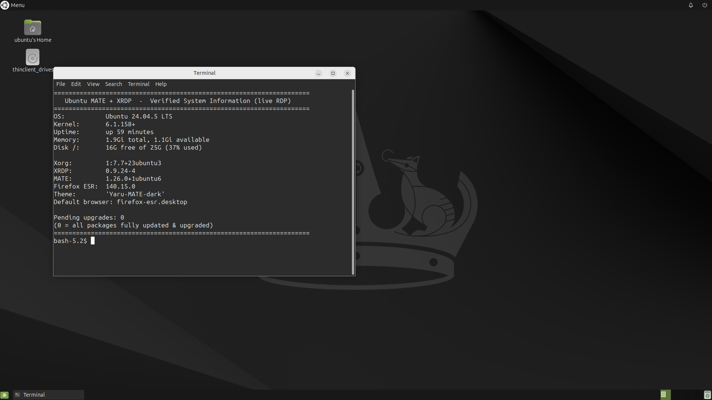
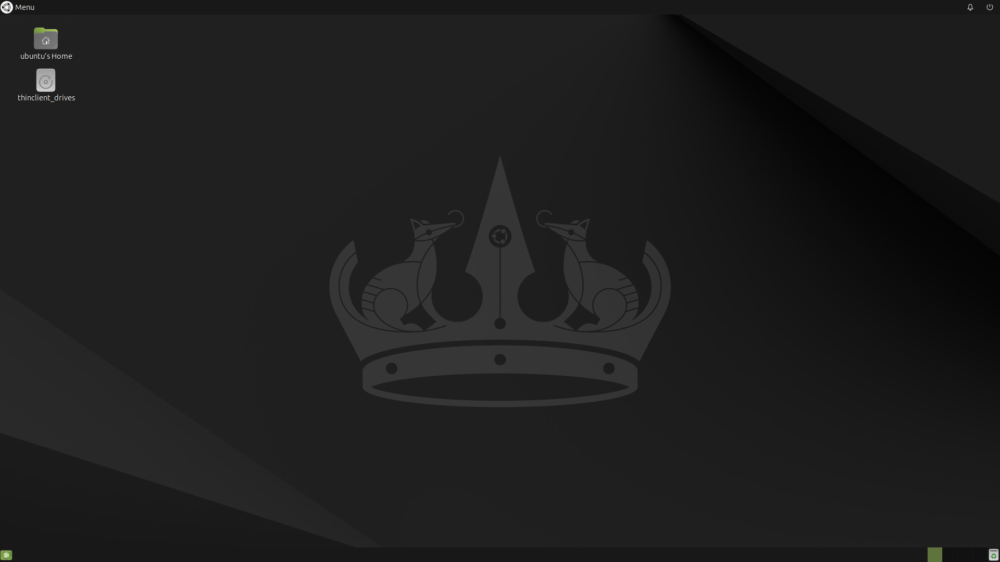
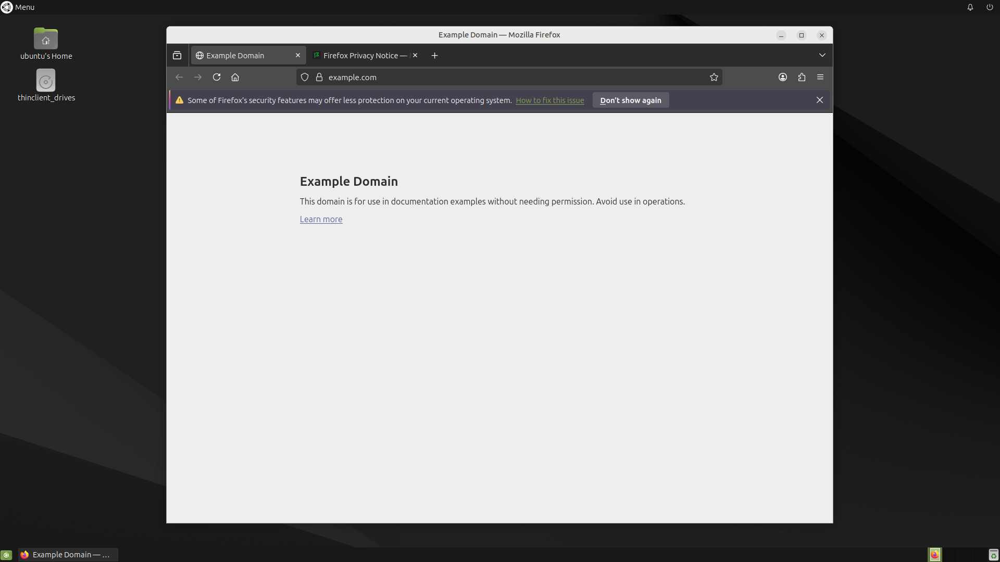

# 🖥️ Ubuntu MATE (Lite) + XRDP on Railway

<p align="center">
  <strong>Run a stock Ubuntu MATE desktop on Railway and connect from Windows using Remote Desktop.</strong>
</p>

<p align="center">
  
  
  
  
  
</p>

<p align="center">
  <em>Ubuntu 24.04.5 LTS (Noble Numbat) • MATE • XRDP • Docker • Railway • Windows RDP</em>
</p>

---

## ✅ What Is This?

This project provides a **stock Ubuntu 24.04.5 LTS (Noble Numbat) MATE desktop** running inside a Docker container — the same wallpaper, apps and features you get when Ubuntu MATE is installed normally on a PC.

It uses:

- 🐧 **Ubuntu 24.04.5 LTS (Noble)** — Linux base system (latest point release)
- 🖥️ **MATE** — lightweight desktop with the stock Ubuntu MATE apps, default panel and the **dark theme** (Yaru-MATE-dark + dark Numbat wallpaper)
- 🦊 **Firefox ESR** — real browser that actually works inside a container (see below)
- 🔐 **XRDP** — Remote Desktop Protocol server
- 🐳 **Docker** — containerized environment
- 🚂 **Railway** — cloud deployment
- 🪟 **Windows Remote Desktop** — connect with the built-in `mstsc`

Every package in the image is **fully updated & upgraded** (security updates included) at build time.

### 🔑 Default RDP Login

| | |
|---|---|
| **Username** | `ubuntu` |
| **Password** | `1122` |

(You can change the password at runtime with the `RDP_PASSWORD` variable — see [RDP Login Information](#-rdp-login-information).)

---

## 📸 Verified — Real RDP Login

The screenshots below were captured from a **real RDP client** (`xfreerdp`, the same protocol Windows `mstsc` uses) connecting to a system built with exactly this setup, logging in with `ubuntu` / `1122`.

### 1. Terminal with system information (inside the live RDP session)

Note the `Pending upgrades: 0` line — everything is fully updated & upgraded.

<p align="center">
  
</p>

### 2. The desktop, right after a normal RDP login

The stock Ubuntu MATE (Noble Numbat) dark wallpaper, dark panel (Yaru-MATE-dark) and all default apps.

<p align="center">
  
</p>

### 3. Bonus: the browser works (this was the bug, now fixed)

Firefox ESR opens and loads web pages — no more *"Failed to execute default Web Browser"* error.

<p align="center">
  
</p>

---

## 🔧 The Browser Error — Fixed

If a container image ships Ubuntu's **snap-based Firefox**, the browser can never start inside Docker/Railway (snap needs systemd, which containers don't have). The result is exactly this error the moment you try to open a web app or link:

> **Failed to execute default Web Browser. Input/output error.**

**Fix in this image:** the official **Mozilla Firefox ESR** build is installed to `/opt/firefox` and registered as the system default browser (`x-www-browser` alternative + MIME defaults). Clicking any link, the menu's *Web Browser* entry, or any app that opens a URL now launches Firefox ESR correctly.

---

## 🌙 Dark Theme (pre-configured)

The image ships with the **Yaru-MATE-dark** theme and the **dark stock Numbat wallpaper** — set at build time in the user's dconf database, so every login is dark by default:

- Window/panel theme: `Yaru-MATE-dark`
- Icon theme: `Yaru-MATE-dark`
- Color scheme: prefer dark (terminal, menus and dialogs are dark)
- Wallpaper: `numbat_wallpaper_dark` (the dark version of the stock Noble Numbat wallpaper)

Want the light theme instead? Inside the session, open a terminal and run:

```bash
gsettings set org.mate.interface gtk-theme "Yaru-MATE-light"
gsettings set org.mate.interface icon-theme "Yaru-MATE-light"
gsettings set org.mate.background picture-filename /usr/share/backgrounds/ubuntu-mate-noble/numbat_wallpaper_green_3480x2160.jpg
```

---

## 🎯 How It Works

```text
┌──────────────────────┐
│      Windows 10      │
│                      │
│  Remote Desktop      │
│      (mstsc)         │
└──────────┬───────────┘
           │
           │ RDP / TCP
           ▼
┌──────────────────────┐
│   Railway TCP Proxy  │
│                      │
│ hostname : port      │
└──────────┬───────────┘
           │
           │ TCP
           ▼
┌────────────────────────────────┐
│       Railway Container        │
│                                │
│   Ubuntu 24.04.5 LTS (MATE)    │
│              │                 │
│          XRDP :3389            │
│              │                 │
│            MATE                │
│              │                 │
│   Ubuntu Desktop + Firefox ESR │
└────────────────────────────────┘
```

---

## 📦 Project Structure

```text
ubuntu-lite-xrdp/
├── Dockerfile
├── start.sh
├── connect.rdp        ← ready-made RDP file (username pre-filled)
├── README.md
└── docs/
    ├── screenshot-1-system-info.png
    ├── screenshot-2-desktop.png
    └── screenshot-3-browser.png
```

### `Dockerfile`

Builds the Ubuntu 24.04 LTS environment and installs:

- MATE desktop (stock Ubuntu MATE set: default wallpaper, panel, apps)
- XRDP + Xorg (with `xorgxrdp`)
- Real Firefox ESR browser (set as the default web browser)
- D-Bus, Sudo, curl, openssl and required utilities
- Fully upgrades everything (security updates included)

### `start.sh`

Runs when the container starts. It:

- Sets the password for `ubuntu` (default `1122`, or the `RDP_PASSWORD` variable)
- Starts D-Bus
- Starts `xrdp-sesman`
- Starts XRDP on port `3389`

---

## 🚀 Beginner Setup Guide

Follow the steps below in order.

---

### 1️⃣ Create a GitHub Repository

Create a new repository (for example named `ubuntu-lite-xrdp`) and upload:

```text
Dockerfile
start.sh
README.md
docs/ (optional - screenshots)
```

---

### 2️⃣ Create a Railway Project

Create a Railway account, then create a new project from your GitHub repository.

Railway detects the `Dockerfile` automatically. You do **not** need to install anything on your computer.

---

### 3️⃣ Set the Service Disk Size (important!)

The MATE image with all standard apps is large (≈ **4.8 GB** installed).

Go to your Railway service:

```text
Settings
   ↓
Services
   ↓
Disk size
```

Set the disk to **6 GB or more**, otherwise the build/run will fail with not-enough-space errors.

---

### 4️⃣ Wait for Railway to Build

The first build takes several minutes (MATE + all default apps + Firefox ESR).

Wait until the deployment finishes successfully.

---

### 🔐 5️⃣ (Optional) Change the RDP Password

The default password is `1122`. If you want a different one, open your Railway service:

```text
Variables
```

Create a new environment variable:

#### Variable name

```text
RDP_PASSWORD
```

#### Variable value

```text
MyNewPassword!927
```

Then restart/redeploy the service so the container picks up the variable. The username stays `ubuntu`.

> ⚠️ If the RDP endpoint is public, a strong password is strongly recommended — internet scanners test default credentials continuously.

---

## 🔑 RDP Login Information

Your RDP username is:

```text
ubuntu
```

Your RDP password is:

```text
1122
```

(default — unless you set `RDP_PASSWORD` in Railway Variables)

For example:

```text
Username: ubuntu
Password: 1122
```

### 📌 Username is pre-filled — you only type the password

This repo includes **`connect.rdp`**, a ready-made Windows RDP file with the username already set:

```text
full address:s:REPLACE_WITH_RAILWAY_TCP_ADDRESS
username:s:ubuntu
```

So at login you do **not** need to type the username — only the password.

**How to use it:**

1. Download `connect.rdp` from this repo
2. Open it with a text editor (Notepad)
3. Replace `REPLACE_WITH_RAILWAY_TCP_ADDRESS` with your Railway TCP address, e.g.:

```text
full address:s:abc123.proxy.rlwy.net:18472
```

4. Save the file and **double-click** it (it opens in Windows Remote Desktop with `ubuntu` already filled in)
5. Press **Connect** and type only the password: `1122`

> 💡 Even if you connect normally with `mstsc`, Windows can remember the username for you: on the first login window tick **“Remember my username”** — from the next time only the password is needed.

---

### 🌐 6️⃣ Configure Railway TCP Proxy

This step is required.

RDP uses TCP, while a normal Railway public domain is intended for web traffic. Your container listens for RDP on:

```text
3389
```

Go to your Railway service:

```text
Settings
   ↓
Networking
   ↓
TCP Proxy
```

Create a TCP Proxy for:

```text
3389
```

---

## ⚠️ Important: HTTP Domain ≠ RDP Address

Railway may provide an address similar to:

```text
https://your-project.up.railway.app
```

❌ Do **not** use this for Windows Remote Desktop.

You need the **TCP Proxy** address:

```text
something.proxy.rlwy.net:12345
```

✅ This is what you use for RDP.

---

### 📡 7️⃣ Find Your TCP Proxy Address

After creating the TCP Proxy, Railway shows the public hostname and port:

```text
Hostname:
abc123.proxy.rlwy.net

Port:
18472
```

Combine them:

```text
abc123.proxy.rlwy.net:18472
```

---

### 🪟 8️⃣ Connect From Windows

**Easiest way (username pre-filled):** use the `connect.rdp` file from this repo — see [RDP Login Information](#-rdp-login-information). Just replace the address line and double-click it.

**Manual way:**

Press:

```text
Windows Key + R
```

Type:

```powershell
mstsc
```

Press **Enter**, then in the **Computer** field enter your Railway TCP address:

```text
abc123.proxy.rlwy.net:18472
```

Click **Connect**, then use:

```text
Username: ubuntu   (tick "Remember my username" to never type it again)
Password: 1122
```

🎉 The Ubuntu MATE desktop opens.

---

## 🛠️ What Was Disabled (and why)

A few standard components cannot work inside a container and would otherwise crash on login and show *"Mate has experienced an internal error"*. They are disabled in the image (everything else is stock):

| Component | Why disabled in a container |
|---|---|
| `mate-power-manager` | no power/battery hardware exists in a container |
| `ayatana-indicator-power` | the panel's power icon (needs the power manager) |
| `ayatana-indicator-printers` + `print-applet` | no CUPS printing service is needed/available |
| `update-notifier` | apt updates happen at image build time, not inside the running container |

---

## 💾 Important: Container Storage

A container is not a VPS. It may be restarted, redeployed, or replaced.

Do **not** assume files saved inside the container survive a redeployment. If you need permanent data, configure persistent storage separately.

(Password change survives redeploys because `start.sh` re-applies it from the `RDP_PASSWORD` variable / default on every boot.)

---

## 🔗 Want Ubuntu 26.04 LTS?

MATE is packaged for 26.04 (Resolute). To use the latest LTS instead, change the first line of the `Dockerfile`:

```dockerfile
FROM ubuntu:26.04
```

Everything else works the same way. (24.04.5 LTS was kept as the default because it is the longest-supported, battle-tested choice.)

---

## 📋 Complete Setup Checklist

- [ ] GitHub repository with `Dockerfile`, `start.sh`, `README.md`
- [ ] Railway project connected to the repository
- [ ] Service **Disk size ≥ 6 GB**
- [ ] Build finished successfully
- [ ] (Optional) `RDP_PASSWORD` variable set + redeploy
- [ ] TCP Proxy created for internal port `3389`
- [ ] Copy TCP `hostname:port`
- [ ] Windows: `Win + R` → `mstsc`
- [ ] Enter `hostname:port` → Connect
- [ ] Username `ubuntu` / Password `1122` (or your `RDP_PASSWORD`)
- [ ] Ubuntu MATE desktop appears 🎉

---

## 📌 Quick Reference

| Setting | Value |
|---|---|
| 🐧 OS | Ubuntu 24.04.5 LTS (Noble Numbat) |
| 🖥️ Desktop | MATE (stock apps, dark theme) |
| 🌙 Theme | Yaru-MATE-dark + dark Numbat wallpaper |
| 🦊 Browser | Firefox ESR (container-compatible, default) |
| 📌 RDP file | `connect.rdp` (username pre-filled) |
| 🔐 Remote Protocol | XRDP / RDP |
| 🔌 Container Port | 3389 |
| 👤 Username | `ubuntu` |
| 🔑 Password | `1122` (default; override with `RDP_PASSWORD`) |
| ☁️ Hosting | Railway (TCP Proxy → 3389) |
| 💾 Disk | ≥ 6 GB |
| 🪟 Client | Windows Remote Desktop (`mstsc`) |

---

## 🚀 Quick Start (short version)

```text
1. Push this project to GitHub
          ↓
2. Deploy on Railway  (disk size ≥ 6 GB)
          ↓
3. (Optional) add Railway variable RDP_PASSWORD=...
          ↓
4. Create Railway TCP Proxy → 3389
          ↓
5. Copy Railway TCP hostname:port
          ↓
6. mstsc → hostname:port
          ↓
7. Username: ubuntu   Password: 1122
          ↓
8. Enjoy Ubuntu MATE 🎉
```

---

## 🛠️ Troubleshooting

### ❌ "Failed to execute default Web Browser" / browser won't open

Fixed in this image — Firefox ESR is installed and set as the default browser.
If you see it again, confirm the deployment is running the **new** image (redeploy).

### ❌ RDP Cannot Connect

1. Is the service running? (deployment succeeded)
2. Is the **TCP Proxy** enabled for port `3389`?
3. Are you using the TCP address (`hostname:port`), **not** the `https://...up.railway.app` domain?
4. Did you use the **external** port from Railway (it may not be 3389)?

### ❌ Login Failed

- Username must be exactly: `ubuntu`
- Password must be `1122`, or the current value of `RDP_PASSWORD`
- If you changed `RDP_PASSWORD`, did you **redeploy** the service?
- Make sure the variable is named exactly `RDP_PASSWORD` (not `PASSWORD` or `RDP_PASS`)

### ❌ Black Screen After Login

- Check Railway logs — you should see `Starting XRDP session manager...` and `Starting XRDP server on port 3389...`
- Confirm the service has enough **disk** (≥ 6 GB) and the deployment didn't fail
- Restart / redeploy the service

### ❌ Build Fails with "no space left on device"

Increase the service **Disk size** (≥ 6 GB) and redeploy.

---

## 🔐 Security Notes

- The default password `1122` is intentionally simple for easy setup.
- If this endpoint is reachable from the internet, set your own strong `RDP_PASSWORD` (uppercase + lowercase + numbers + symbols, 12+ characters).
- Never commit real secrets to GitHub. The password belongs in a Railway variable.

---

## 🧩 Final Architecture

```text
                         INTERNET
                            │
                            ▼
                  ┌──────────────────┐
                  │      Windows     │
                  │    (mstsc)       │
                  └────────┬─────────┘
                           │ RDP / TCP
                           ▼
                  ┌──────────────────┐
                  │ Railway TCP Proxy│
                  │ hostname : port  │
                  └────────┬─────────┘
                           │ TCP
                           ▼
        ┌────────────────────────────────────┐
        │          Railway Container         │
        │                                    │
        │   Ubuntu 24.04.5 LTS (MATE)        │
        │            │                       │
        │       XRDP :3389                   │
        │            │                       │
        │  MATE Desktop + Firefox ESR        │
        │  (all packages updated & upgraded) │
        └────────────────────────────────────┘
```

---

<p align="center">
  <strong>🖥️ Ubuntu MATE + XRDP + Railway</strong><br>
  <sub>A stock Ubuntu MATE desktop over RDP — verified with real RDP login.</sub>
</p>
